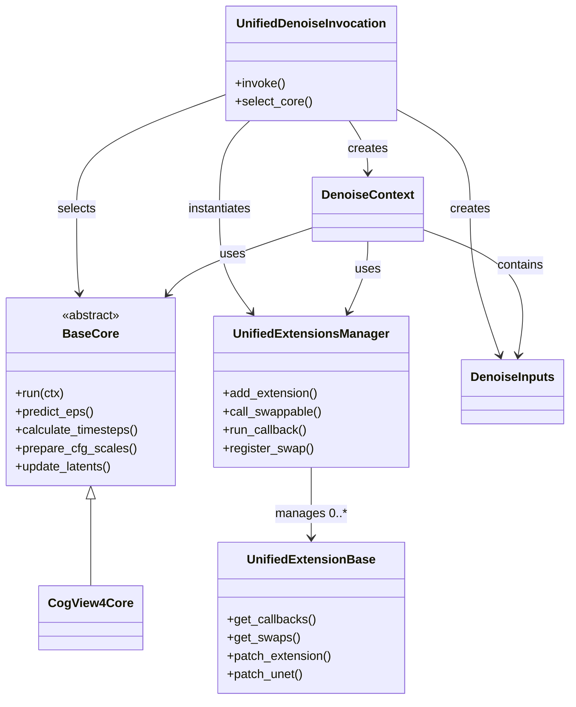
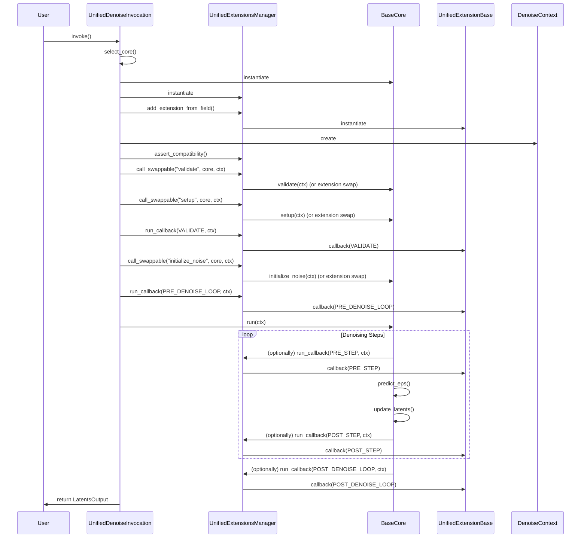

# Unified Denoise Architecture Specification

## Overview

The Unified Denoise system provides a flexible, extensible architecture for running denoising processes across multiple model types. It achieves this by:

- **Dependency injection of "Cores"**: Each model type (e.g., CogView4, SDXL, etc.) provides a "core" class encapsulating its denoising logic.
- **Extension mechanism**: Extensions can hook into or override core logic at well-defined points, enabling custom behaviors, patching, or additional features.

This design allows new models and customizations to be integrated without modifying the standard denoising workflow. It also allows more flexible workflow construction with cross-compatible extensions and graceful compatibility handling.

---

## Key Components

### 1. Unified Denoise Node

- **Entry point**: [`UnifiedDenoiseInvocation`](../../../invokeai/app/invocations/unified_denoise.py)
- **Responsibilities**:
  - Gathers all required inputs (latents, model, conditioning, etc.)
  - Selects the appropriate core based on model type
  - Instantiates and configures extensions
  - Orchestrates the denoising process by delegating to the core and extension manager

### 2. Core Classes

- **Base class**: [`BaseCore`](../../../invokeai/backend/unified_denoise/core_base.py)
- **Registration**: Cores are registered via the `@denoise_core` decorator and stored in `DENOISE_CORES`.
- **Responsibilities**:
  - Implement model-specific denoising logic (timesteps, noise prediction, CFG, etc.)
  - Provide overridable hooks for extensions
  - Expose a uniform interface for the denoising process

- **Example**: [`CogView4Core`](../../../invokeai/backend/unified_denoise/core_cogview4.py) for CogView4 models

### 3. Extension System

- **Base class**: [`UnifiedExtensionBase`](../../../invokeai/backend/unified_denoise/unified_extensions_base.py)
- **Registration**: Extensions are registered via the `@denoise_extension` decorator and stored in `DENOISE_EXTENSIONS`.
- **Responsibilities**:
  - Hook into the denoising process at defined callback points (e.g., validate, setup, pre/post denoise loop, pre/post step)
  - Optionally swap out core functions (e.g., replace noise prediction)
  - Provide compatibility checks for model types

- **Callback Types**: Defined in [`ExtensionCallbackType`](../../../invokeai/backend/unified_denoise/extension_callback_type.py)
- **Swappable Functions**: Extensions can override core methods using the `@swap` decorator

### 4. Extension Manager

- **Class**: [`UnifiedExtensionsManager`](../../../invokeai/backend/unified_denoise/unified_extensions_manager.py)
- **Responsibilities**:
  - Manages the lifecycle and ordering of extensions
  - Dispatches callbacks to extensions
  - Handles function swaps (overrides)
  - Ensures compatibility between extensions and the selected core/model

### 5. Context Objects

- **DenoiseInputs**: Immutable input parameters for the denoising process ([`DenoiseInputs`](../../../invokeai/backend/unified_denoise/unified_denoise_context.py))
- **DenoiseContext**: Mutable state for the current denoising run ([`DenoiseContext`](../../../invokeai/backend/unified_denoise/unified_denoise_context.py))

---

## Class Diagram

---

## Sequence Diagram

---

## Control Flow

- The invocation node selects a core and instantiates extensions.
- The extension manager registers callbacks and function swaps.
- The denoising loop is run via the core, with extensions able to hook or override at key points.
- The process produces the final latents output.

---

## Extensibility Model

- **Adding a new model**: Implement a new core subclass, register with `@denoise_core`.
- **Customizing behavior**: Implement an extension, register with `@denoise_extension`, and specify which callbacks or core functions to hook/swap.
- **Injection points**:
  - **Callbacks**: Extensions can run code before/after denoise loop, steps, UNet calls, etc.
  - **Function swaps**: Extensions can fully replace core methods (e.g., noise prediction, scheduler logic).

---

## Example: CogView4 as a Core

- [`CogView4Core`](../../../invokeai/backend/unified_denoise/core_cogview4.py) implements the denoising logic for CogView4 models.
- Registered as `CORE_CogView4` and selected when a CogView4 model is used.
- Extensions can be applied to modify or augment CogView4 denoising without changing the core code.

---

## Summary Table

| Component                | File/Location                                         | Role                                      |
|--------------------------|------------------------------------------------------|-------------------------------------------|
| UnifiedDenoiseInvocation | [`unified_denoise.py`](../../../invokeai/app/invocations/unified_denoise.py) | Entry point, orchestrates process         |
| BaseCore                 | [`core_base.py`](../../../invokeai/backend/unified_denoise/core_base.py) | Abstract base for model-specific logic    |
| CogView4Core             | [`core_cogview4.py`](../../../invokeai/backend/unified_denoise/core_cogview4.py) | Example core for CogView4                 |
| UnifiedExtensionBase     | [`unified_extensions_base.py`](../../../invokeai/backend/unified_denoise/unified_extensions_base.py) | Base for extensions                       |
| UnifiedExtensionsManager | [`unified_extensions_manager.py`](../../../invokeai/backend/unified_denoise/unified_extensions_manager.py) | Manages extensions and swaps              |
| DenoiseContext/Inputs    | [`unified_denoise_context.py`](../../../invokeai/backend/unified_denoise/unified_denoise_context.py) | Holds state and parameters                |
| ExtensionCallbackType    | [`extension_callback_type.py`](../../../invokeai/backend/unified_denoise/extension_callback_type.py) | Enumerates callback points                |

---

## Design Principles

- **Separation of concerns**: Model-specific logic is isolated in cores; customizations are handled by extensions.
- **Loose coupling**: Cores and extensions interact via well-defined interfaces and injection points.
- **Extensibility**: New models and behaviors can be added without modifying the core workflow.
- **Runtime flexibility**: Extensions and cores are selected and injected at runtime based on user input and model type.